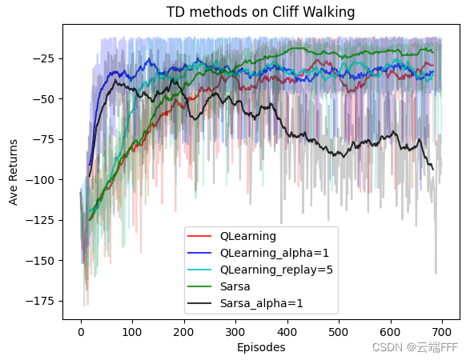

[toc]

# About this repository

- I decided to upload all my RL task demo here, include
  1. Project code written while learning
  2. Code written for some competition
  3. Anything about RL task... I don‘t know
- Anyway, I hope every project here is complete, and can be run or train directly to solve an individual RL task
- The project name will follow this format: `[env_name] task_name (method_name/method_type)`

# Demo List

## 1. [JiDi_platform] competition-olympics-running (Rule-based)

- **Project type**: A recurrence project for [an RL competition on JiDi AI platform](http://www.jidiai.cn/compete_detail?compete=12)
- **Raw Champion code**: [Luanshaotong/Competition_Olympics-Running](https://gitee.com/luanshaotong/competition-olympics-running/blob/lst/olympics/submission.py)

- **Detailed description**: [RL 实践（0）—— 及第平台辛丑年冬赛季【Rule-based policy】](https://blog.csdn.net/wxc971231/article/details/125438242)

## 2. [Handcraft Env] K-arms bandit (MC)

- **Project type**:  Compare the performance of four simple ways to balance exploration and exploitation in K-arms bandit environment, include

  1. $\epsilon$-greedy
  2. Decaying $\epsilon$-greedy
  3. Upper confidence bound (UCB)
  4. Thompson sampling

  note that K-arms bandit environment is a simplified version of RL paradigm without state transform

- **Detailed description**: [RL 实践（1）—— 多臂赌博机](https://blog.csdn.net/wxc971231/article/details/127103190)

## 3. [Handcraft Env] Jack's Car Rental (Policy Iteration & Value Iteration)

- **Project type**:  Implement an example of 《Reinforcement Learning An Introduction》with GUI

  

- **Detailed description**: [RL 实践（2）—— 杰克租车问题【策略迭代 & 价值迭代】](https://blog.csdn.net/wxc971231/article/details/127222242)

## 4_[Gym Custom] Cliff Walking (Q-Learning series and Sarsa series)

- **Project type**: Compare the performance of a series of tabular RL algorithm, include
  
  1. Sarsa
  2. Expected Sarsa
  3. N-step Sarsa
  4. N-step Tree Backup
  5. Q-Learning
6. Double Q-Learning

- **Brief introduction**: The experiment was conducted in a custom Cliff Walking environment based on gym. As you can see, there are two test files were written for each algorithm：

  1. The code whose filename start with `RL_` are used to **show the convergence process**, there will be a env UI and the agent will be trained with a **single** random seed

  2. The code whose filename start with `Performance_` are used to **record the performance of the algorithm**, the agent will be trained with **three** different random seed, and the average return curve will be save in "data" folder as `.npy` file. Once the curve data saved, you can run `Performance_compare.py` to load them and generate compare figure like

     

- **Detailed description**: [RL 实践（3）—— 悬崖漫步【QLearning & Sarsa & 各种变体】](https://blog.csdn.net/wxc971231/article/details/128180067)

## 5_[Gym Custom] Rolling Ball (DQN & Double DQN & Dueling DQN)

- **Project type**: Compare the performance of DQN, Double DQN and Dueling DQN
- **Brief introduction**: The experiment was conducted in a custom Rolling-Ball environment based on gym. The Rolling-Ball environment is kind of like Maze2d environment. Imagine a rolling ball on a two-dimensional plane, applying horizontal and vertical forces to it, the ball will move under the action of acceleration. When the ball hits the edge of the plane, it will have a fully elastic collision, and we want the ball to reach the target position as soon as possible under the action of the force

- **Detailed description**: [RL 实践（4）—— 二维滚球环境【DQN & Double DQN & Dueling DQN】](https://blog.csdn.net/wxc971231/article/details/131865151)

## 6_[Gym Custom] Rolling Ball (REINFORCE and Actor-Critic)

- **Project type**: Compare the performance of REINFORCE and Actor-Critic, which are two simplest policy gradient RL methods
- **Brief introduction**: The experiment was conducted in a custom Rolling-Ball environment based on gym. The Rolling-Ball environment is kind of like Maze2d environment. Imagine a rolling ball on a two-dimensional plane, applying horizontal and vertical forces to it, the ball will move under the action of acceleration. When the ball hits the edge of the plane, it will have a fully elastic collision, and we want the ball to reach the target position as soon as possible under the action of the force
- **Detailed description**: [RL 实践（5）—— 二维滚球环境【REINFORCE & Actor-Critic】](https://blog.csdn.net/wxc971231/article/details/131882224)

## 7_[Gym] CartPole-V0 (REINFORCE with baseline and A2C)

- **Project type**: Validate the advantages of the policy gradient with baseline over the original REINFORCE & Actor-Critic approach without baseline on CartPole-V0 env
- **Detailed description**: [RL 实践（6）—— CartPole【REINFORCE with baseline & A2C】](https://blog.csdn.net/wxc971231/article/details/131981803)

## 8_[Gym] CartPole-V0 (PPO)

- **Project type**: Test the PPO algorithm on the CartPole-V0 environment, which is one of the most popular Online RL methods
- **Detailed description**: [RL 实践（7）—— CartPole【TPRO & PPO】](https://blog.csdn.net/wxc971231/article/details/132214844)

...to be continued